# Ground Plane Estimation from a Single Image

Monocular ground-plane (drivable-surface) detection with **no depth sensor and no
camera calibration** — just a single RGB image. Developed for the *AmigoBot*
robot-navigation project as undergraduate research at IIT Madras.

The method combines learned monocular depth with a superpixel region graph so
that planarity can be reasoned about over coherent surface patches rather than
raw pixels.

## Method

### 1. Monocular depth (MiDaS)

Estimate a relative inverse-depth map from the single input image. Three MiDaS
backbones were compared; **Hybrid** was chosen as the accuracy-vs-speed
trade-off.

<table>
  <tr>
    <td align="center">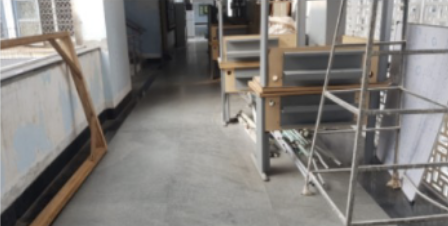<br/><em>Input image</em></td>
    <td align="center">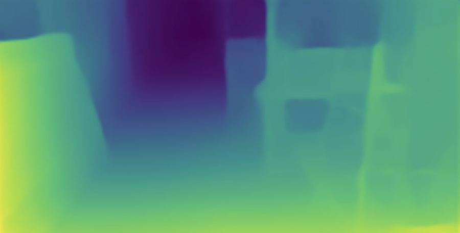<br/><em>MiDaS Small</em></td>
  </tr>
  <tr>
    <td align="center">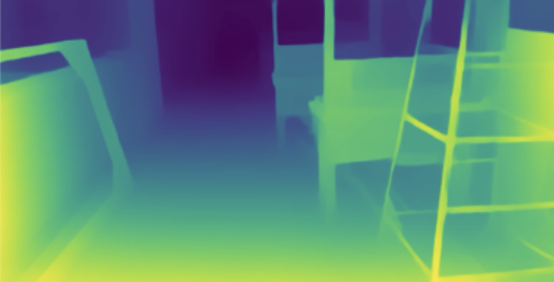<br/><em>MiDaS Hybrid</em></td>
    <td align="center">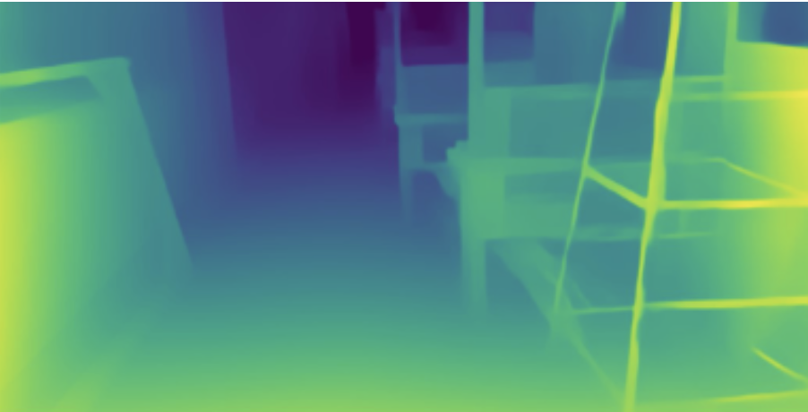<br/><em>MiDaS Large</em></td>
  </tr>
</table>

| MiDaS model | avg. inference time (s) |
| ----------- | ----------------------- |
| Small       | 0.1184                  |
| Hybrid      | 0.2269                  |
| Large       | 0.4022                  |

### 2. Superpixels + region graph

Over-segment with SLIC, build a boundary Region Adjacency Graph (RAG), and
hierarchically merge regions separated only by weak boundaries into larger
surface patches.

<table>
  <tr>
    <td align="center">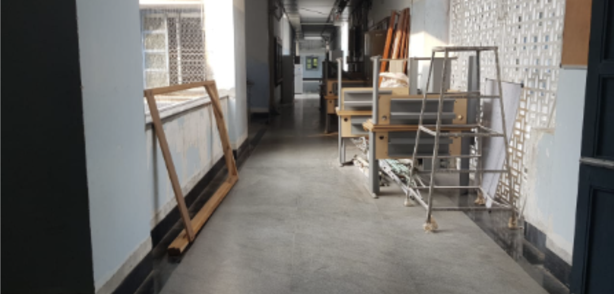<br/><em>Original image</em></td>
    <td align="center">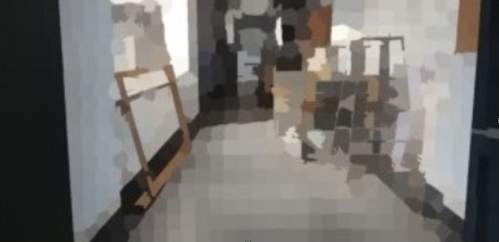<br/><em>SLIC segmentation (600 superpixels)</em></td>
  </tr>
  <tr>
    <td align="center">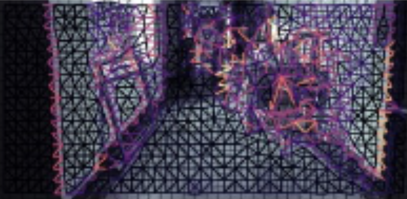<br/><em>RAG with weighted edges</em></td>
    <td align="center">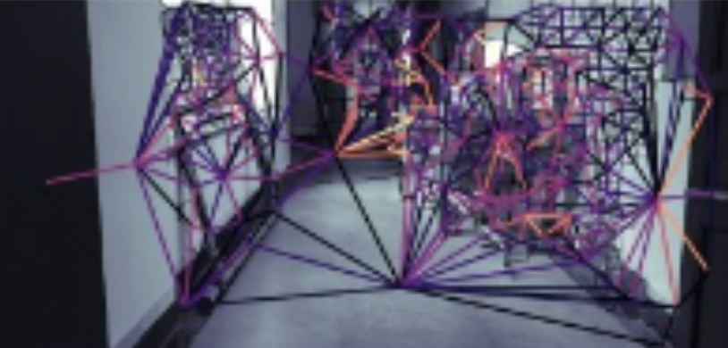<br/><em>After hierarchical merging</em></td>
  </tr>
</table>

### 3. Per-region plane fitting

Lift each region's pixels to 3D `(row, col, depth)` and fit a plane by SVD; the
plane normal is the direction of least variance.

### 4. Region growing over the graph

Seed from the bottom-centre region (assumed ground) and run a BFS across the
RAG, absorbing neighbouring regions whose plane normal is near-parallel to the
seed's. The union of accepted regions is the ground mask.

Keeping superpixel structure through the pipeline means planarity propagates
along genuinely adjacent surfaces instead of leaking across the pixel grid — the
same structure-preserving idea that motivates the rest of my later work.

## Results

The pipeline, stage by stage — SLIC over-segmentation, hierarchical merging,
coplanar region merging, the resulting binary mask, and the final ground-plane
overlay:

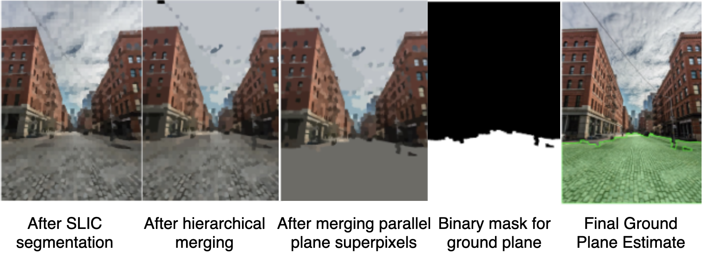

Ground-plane estimates on indoor corridor scenes:

<table>
  <tr>
    <th>Input</th>
    <th>Ground-plane estimate</th>
  </tr>
  <tr>
    <td align="center">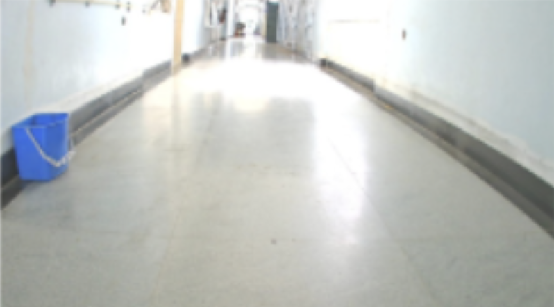</td>
    <td align="center">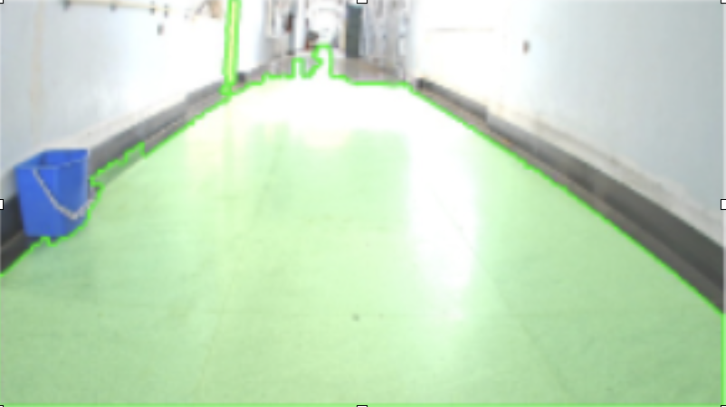</td>
  </tr>
  <tr>
    <td align="center">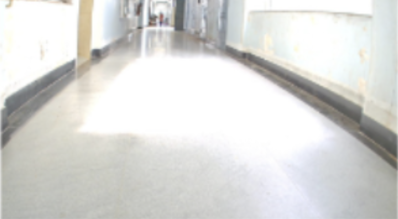</td>
    <td align="center">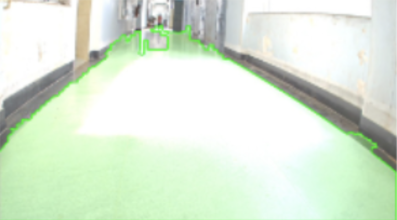</td>
  </tr>
  <tr>
    <td align="center">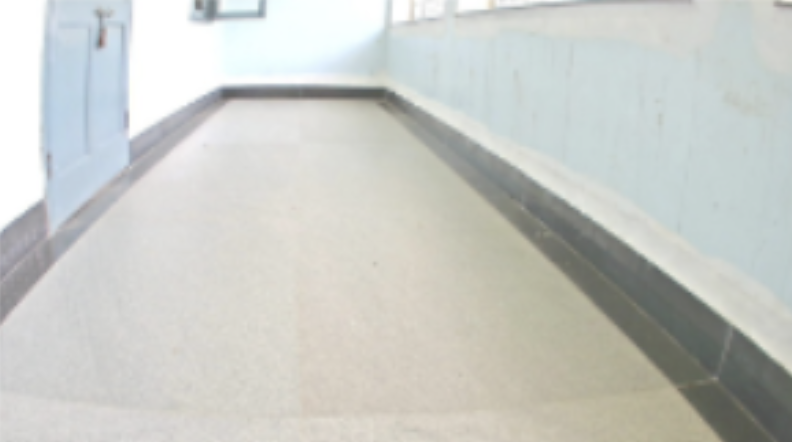</td>
    <td align="center">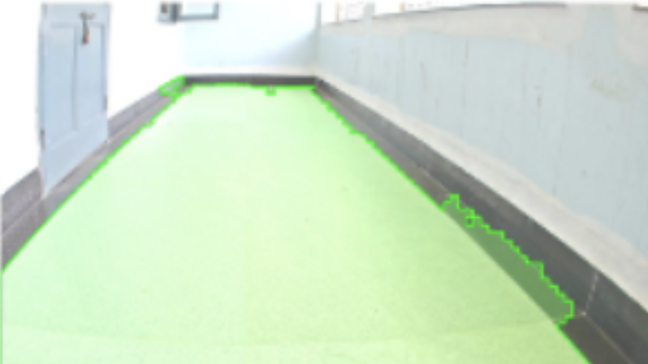</td>
  </tr>
  <tr>
    <td align="center"></td>
    <td align="center">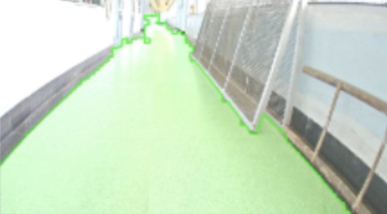</td>
  </tr>
</table>

The estimate stays stable across consecutive video frames, including under
strong shadow patterns:

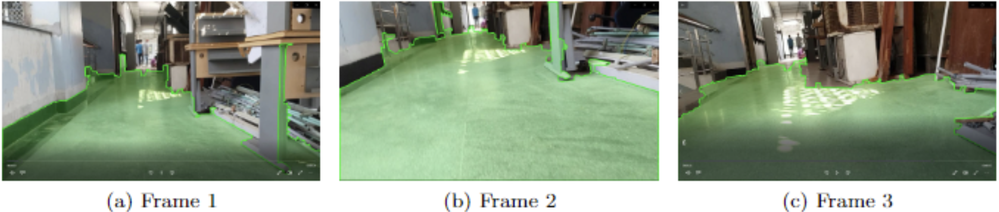

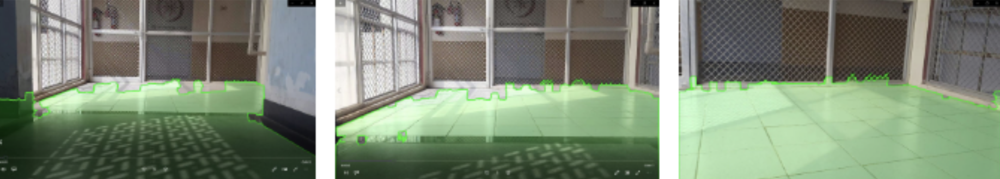

## Usage

Put inputs in `./input/` and results are written to `./output/`.

```python
# single image: input/1.jpg
run_on_image("1", components=2000)

# video: input/5.mp4  (samples every 5th frame, writes output/5.avi)
run_on_video("5", components=2000)
```

Key knobs:

| parameter      | effect                                                          |
| -------------- | -------------------------------------------------------------- |
| `components`   | number of SLIC superpixels (higher = finer segmentation)       |
| `merge_thresh` | RAG merge threshold (higher = more aggressive region merging)  |
| `plane_thresh` | coplanarity cutoff on normal dot-product (closer to 1 = strict)|

## Known limitations

- **Orientation-only coplanarity.** The region-growing test compares plane
  *normals*, not offsets, so two parallel surfaces at different heights can be
  merged. Adding a distance-to-plane term would tighten this.
- **Relative depth.** MiDaS produces relative (not metric) depth, so the fitted
  planes are correct in orientation but not to absolute scale.
- **Seed assumption.** The bottom-centre region is assumed to be ground, which
  holds for forward-facing navigation views but not for arbitrary viewpoints.

## Requirements

See `requirements.txt`. Note the code targets the older scikit-image RAG API
(`skimage.future.graph`); on newer scikit-image this module moved to
`skimage.graph`.

## Notes

Undergraduate research project (UGRP), IIT Madras. Code and method by the
repository author. Advised by Prof. Manivannan.
